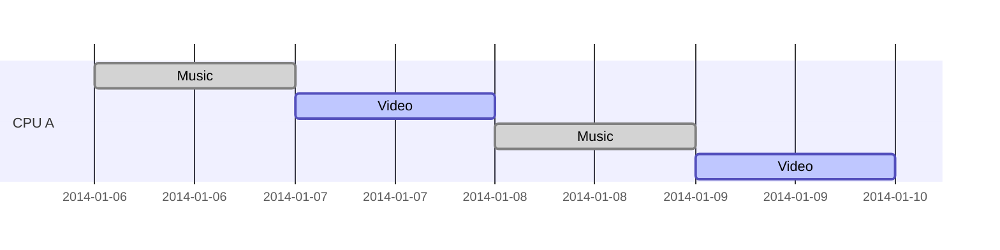
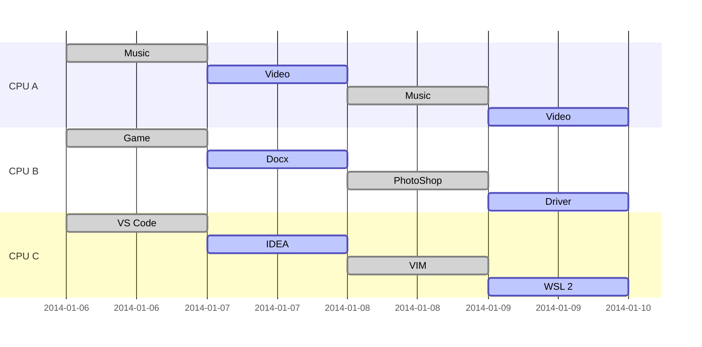

# Python的并发与并行小实验 | Ray与基于Ray的项目实现

<br>
<br>
<br>

刘洪佳 2021年6月10日

---

# 将讨论...

<div grid="~ cols-2 gap-2">

<div>

<br>

## 纲要

<br>

- Ray 是什么？
  - Ray 的定位
   - 什么是并发[多线程]，并行[多进程]？
   - 实例：欧拉函数（单线程/多线程/多进程）
  - Ray 的基本用法
    - Ray 的欧拉函数小实验
- MuZero 是什么？
  - MuZero 的前辈们
  - MuZero 的基本原理
  - MuZero 的实现结构
  - MuZero 运行

</div>

<div>

<br>

## 参考

<br>

- Python 的多线程与多进程：[多线程并发](https://docs.python.org/zh-cn/3.7/library/threading.html)，[多进程并行](https://docs.python.org/zh-cn/3.7/library/multiprocessing.html)
- Ray 官方文档：[https://docs.ray.io/en/master/index.html](https://docs.ray.io/en/master/index.html)
- MuZero 的论文：[Mastering Atari, Go, chess and shogi by planning with a learned model](https://rdcu.be/ccErB)
- DeepMind 对 MuZero 的介绍：[MuZero: Mastering Go, chess, shogi and Atari without rules](https://deepmind.com/blog/article/muzero-mastering-go-chess-shogi-and-atari-without-rules)
- MuZero 的民间实现：[github.com/werner-duvaud/muzero-general](https://github.com/werner-duvaud/muzero-general)

</div>

</div>


---

# Ray

Ray 是 UC Berkeley RISELab 出品的机器学习分布式框架。

定位：
- 多进程
  - 分布式异步调用
  - 方便的进程间通信
- 含有 `tune` 、 `rllib` 等工具

```python {all|5-7|9-10|all}
import ray

ray.init()

@ray.remote
def remote_chain_function(value):
  return value + 1

y1_id = remote_chain_function.remote(0)
assert ray.get(y1_id) == 1
```

> 参考：[彭正皓：超强的强化学习系统怎么实现？Ray是啥？tune和rllib又是什么？](https://www.bilibili.com/video/BV1VE411w73P)

---


# 并发与并行


## 并发与多线程



## 并行与多进程



人类更想“多线程”，一个时刻只能做一件事；而“多线程”则类似多人协作。

---

<div grid="~ cols-2 gap-2">

<div>

## 多线程

多线程更强调对资源合理运用。常见的例子如服务端程序的高并发。
- 一块 CPU 负责应对多个客户端，每个请求申请了一个新线程
- 一块 CPU 就能「同时」服务多个客户

应该注意：
- 数据安全需要额外注意
- 比如我的支付宝账户同时向外转账、向内汇款
- 本来 100 元钱
  - 1时刻我给 A 转账 10 元，线程1读取我有 100 元，准备进行 100 - 10 运算
  - 2时刻 B 向我转账 50 元，线程2读取我有 100 元，准备进行 100 + 50 运算
  - 3时刻线程1计算完成，写回我的账户 90 元
  - 4时刻线程2计算完成，写回我的账户 150 元
- 出错，因此线程要上『锁🔒』

<style>
li {
  font-size: 12px;
}
</style>

</div>

<div>

## 多进程

多进程强调使用更多的资源，常见于计算量很大且可以拆分的算法。
- 一个任务可以分成好几份
- 则把这些任务分给不同的进程

同样需要注意数据安全。


</div>

</div>

---

## 实例

将使用常规串行、多线程并发、多进程并行进行大规模欧拉函数计算。

### 欧拉函数

<!-- $1\sim N$ 中与 $N$ 互质的数的个数被称为欧拉函数，记为 $\phi (N)$。

若在算数的基本定理中，$N = p_1^{a_1} p_2^{a_2} ... p_m^{a_m}$ ，则

$$\phi (N) = N \times \frac{p_1 - 1}{p_1} \times \frac{p_2 - 1}{p_2} \times ... \times \frac{p_m - 1}{p_m}$$
 -->

```python
def euler_func(n: int) -> int:
    res = n
    i = 2
    while i <= n // i:
        if n % i == 0:
            res = res // i * (i - 1)
            while (n % i == 0): n = n // i
        i += 1
    if n > 1:
        res = res // n * (n - 1)
    return res
```

期望：
- 效率上多进程`好于`正常`好于`多线程
- 因为切换线程也有开销

---

## 正常串行

<br>
<br>

```python {all|1-4|6-8|10-14}
# 把任务分成三份
task1 = list(range(2, 50000, 3))  # 2, 5, ...
task2 = list(range(3, 50000, 3))  # 3, 6, ...
task3 = list(range(4, 50000, 3))  # 4, 7, ...

def job(task: List):
    for t in task:
        euler_func(t)

@timer
def normal():
    job(task1)  # 完成 job(task1) 再进行下面的代码
    job(task2)  # 完成 job(task2) 再进行下面的代码
    job(task3)  # 完成 job(task3) 再进行下面的代码
```

---

## 多线程并发

```python {all|1-4|6-8|10-24}
# 把任务分成三份
task1 = list(range(2, 50000, 3))  # 2, 5, ...
task2 = list(range(3, 50000, 3))  # 3, 6, ...
task3 = list(range(4, 50000, 3))  # 4, 7, ...

def job(task: List):
    for t in task:
        euler_func(t)

import threading as th

@timer
def mutlthread():
    th1 = th.Thread(target=job, args=(task1, ))
    th2 = th.Thread(target=job, args=(task2, ))
    th3 = th.Thread(target=job, args=(task3, ))

    th1.start()  # 程序完全不会阻塞，会继续进行下面的代码
    th2.start()
    th3.start()

    th1.join()  # join() 表示这个线程结束，才进行下面的代码
    th2.join()
    th3.join()
```

---

## 多进程并行

```python {all|10-24}
# 把任务分成三份
task1 = list(range(2, 50000, 3))  # 2, 5, ...
task2 = list(range(3, 50000, 3))  # 3, 6, ...
task3 = list(range(4, 50000, 3))  # 4, 7, ...

def job(task: List):
    for t in task:
        euler_func(t)

import multiprocessing as mp

@timer
def multcore():
    p1 = mp.Process(target=job, args=(task1, ))
    p2 = mp.Process(target=job, args=(task2, ))
    p3 = mp.Process(target=job, args=(task3, ))

    p1.start()
    p2.start()
    p3.start()

    p1.join()
    p2.join()
    p3.join()
```

---

## Ray该如何做？

```python {all|10-25}
# 把任务分成三份
task1 = list(range(2, 50000, 3))  # 2, 5, ...
task2 = list(range(3, 50000, 3))  # 3, 6, ...
task3 = list(range(4, 50000, 3))  # 4, 7, ...

def job(task: List):
    for t in task:
        euler_func(t)

import ray
ray.init()

@timer
def rayfunc():
    @ray.remote  # 把工作修饰为 ray 的任务
    def ray_job(task):
        job(task)

    id1 = ray_job.remote(task1)
    id2 = ray_job.remote(task2)
    id3 = ray_job.remote(task3)

    ray.get(id1)
    ray.get(id2)
    ray.get(id3)
```

---

## 代码实例

### 实例1

见附件 [codes/compare3.py](#) ：
- 将 2 到 49999 的数分成三份，分别求其欧拉函数值
- 这三份分别交给三个不同的 线程 / 进程 去做
- 效果符合预期

### 实例2

见附件 [codes/compare4.py](#) ：
- 带有 `ray` 的实现，可以跑
- `win10 wsl2` 平台报错解决方法未知

### 实例3

见 [codes/compare_*.py](#) ：
- 涉及到数据上锁，动态分配任务（`threading.Lock`、`mp.Queue`等）
- 效果不符合预期，可能上下文切换开销相比欧拉函数计算工作量更大

---

# MuZero

MuZero 是 AlphaGo 、 AlphaGo Zero 、 AlphaZero 后的新算法。

|名称|专家数据|适用|真实环境建模|
|---|---|---|---|
|AlphaGo|✔|围棋|✔|
|AlphaGo Zero|❌|围棋|✔|
|AlphaZero|❌|任何棋类|✔|
|MuZero|❌|任何棋类、电子游戏|❌|

<br>

MuZero：
- 探策略
- 估价值
- 学环境

---

# MuZero 项目结构
### muzero.py
- 入口程序
- 声明了几个进程，环境交换和更新参数是并行的

### models.py
- 存储了深度神经网络模型，还有一些用于处理数值的函数
- 一般地，$h(s) \rightarrow s_h, f(s_h) \rightarrow (p, v), g(s_h) \rightarrow s_h'$ 是打包在一起的

### self_play.py
- 函数 SelfPlay.continuous_self_play 用在环境交互的进程里
- 把玩游戏的经历以 game_history 对象形式把每一幕存在 replay_buffer 里
- 这里有 MCTS ，完全按照 MuZero 来的，expand 的过程造成的转移，都是 $g$ 近似出来的

### replay_buffer.py
- 如其名

### shared_storage.py
- 保存全局信息，用于 log 等

### trainer.py
- 三种网络的权重根据历史轨迹数据在 update_weights 更新
- 每一次更新是一步 training_step

<style>
li {
  font-size: 12px;
}
</style>
